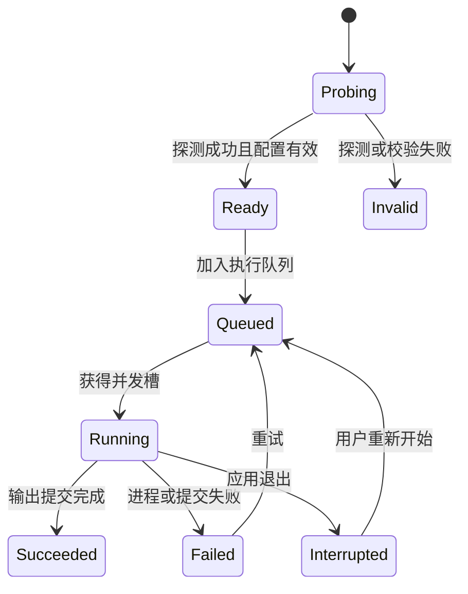

# MediaForge MVP 设计文档

> 状态：MVP 设计基线  
> 依据：[Requirement.md](./Requirement.md)  
> 需求决策已同步；实现发现平台硬约束时再补充设计决策记录。

## 1. 设计目标与边界

首版围绕一条主流程设计：添加媒体 → 查看媒体信息 → 选择输出格式/预设 → 调整有效参数 → 加入队列 → 执行并查看结果。

应用只编排本地 FFmpeg/FFprobe 进程，不实现编解码器。监视文件夹和 CLI 已被需求删除线排除，不设计入口、后台服务或相关任务。

## 2. 关键技术决策

| 主题 | 决策 | 原因与影响 |
| --- | --- | --- |
| UI | C# + WinUI 3 + Windows App SDK | 满足需求并使用原生 Fluent 控件、主题和辅助功能能力 |
| 发布 | unpackaged、x64、自包含 portable 文件夹 | 适合直接运行 exe 和随目录迁移配置；发布产物不是单文件 |
| 架构 | 单进程桌面应用，分层服务 + MVVM | 隔离 UI、队列状态、进程执行和持久化 |
| FFmpeg 集成 | `System.Diagnostics.Process` 启动外部进程 | 边界清晰，便于替换 FFmpeg 并采集输出；避免 AutoGen 的本机 ABI 复杂度 |
| 进程参数 | `ProcessStartInfo.ArgumentList` | 正确处理空格、Unicode 和特殊字符，避免 shell 拼接 |
| 媒体探测 | FFprobe JSON 输出 | 结构稳定，便于映射多流媒体信息 |
| 状态存储 | exe 同级 `config` 下的版本化 JSON | 符合 portable 要求，便于迁移和备份 |
| 队列调度 | 有界并发调度器 | 支持 1–4 个并发任务，避免无限制启动 FFmpeg |
| 输出安全 | 同目录临时输出，成功后受控替换 | 退出和失败不会伪装成完整产物 |
| 日志 | 每任务内存尾部 + 有界文件日志 | UI 可实时查看，同时限制磁盘增长 |

## 3. 解决方案结构

建议解决方案名为 `MediaForge`：

```text
src/
  MediaForge.App/                 WinUI 3 应用、页面、ViewModel、组合根
  MediaForge.Core/                领域模型、参数规则、队列状态机、接口
  MediaForge.Infrastructure/      FFmpeg 进程、文件系统、JSON 配置、日志
tests/
  MediaForge.Core.Tests/          参数规则、命名、状态机测试
  MediaForge.IntegrationTests/    使用小型媒体样本验证 FFmpeg 集成
docs/
config/                           首次运行创建，不提交用户内容
```

依赖方向为 `App → Core ← Infrastructure`。App 在启动时创建服务并将 Infrastructure 的实现注入所需接口。Core 不引用 WinUI、FFmpeg wrapper 或具体 JSON 库。

## 4. 主要组件

### 4.1 App 与导航

使用单个主窗口和 `NavigationView`，顶层只保留三个目的地：转换、预设、设置。日志作为队列项详情打开，不增加顶层导航。

转换页宽屏采用“任务列表 + 参数面板”双栏；中等宽度收窄参数面板；窄窗口改为单栏，通过详情面板编辑参数。队列使用可虚拟化的 `ListView`，页面只保留一个明确的垂直滚动所有者。页面级批量操作使用原生 `CommandBar`。

### 4.2 UI 状态与 MVVM

ViewModel 负责可观察状态和命令，服务负责 I/O 与执行。建议使用 CommunityToolkit.Mvvm 减少属性通知和命令样板，但不引入 Toolkit UI 控件作为基础依赖。

- `ConversionWorkspaceViewModel`：当前编辑参数、输入选择、输出预览。
- `QueueViewModel` / `QueueItemViewModel`：队列展示与用户命令。
- `PresetsViewModel`：内置和用户预设管理。
- `SettingsViewModel`：设置编辑、校验和保存。

所有耗时服务均异步执行；只有更新绑定状态时切回 UI 调度器。

### 4.3 FFmpeg 工具解析与能力探测

`FfmpegToolResolver` 先检查用户设置的目录，再检查 `MediaForge.exe` 所在目录。用户负责下载并放置 `ffmpeg.exe` 与 `ffprobe.exe`；应用不使用 PATH、不捆绑、不下载工具。两者缺一或版本调用失败时返回结构化诊断，不允许任务进入运行态。

`FfmpegCapabilityService` 缓存版本及 encoders、decoders、muxers、demuxers、filters、hwaccels。硬件编码器要通过短任务验证；“二进制声明存在”和“当前机器实际可用”分开表示。只有用户选择的功能不受当前版本或构建支持时才提示更换或更新 FFmpeg，不做常规版本提醒。

### 4.4 媒体探测

`MediaProbeService` 调用 FFprobe 输出 JSON，并映射为不可变模型：

```text
MediaSourceInfo
  Path, Container, Duration, Size, BitRate
  Streams[]
    Index, Type, Codec, Language, Title, IsDefault
    Video: Width, Height, FrameRate, PixelFormat
    Audio: SampleRate, Channels, ChannelLayout, BitRate
    Subtitle: Codec
```

添加文件夹打开应用内导入对话框。对话框包含目录、递归开关、过滤模式（全部、关键字、通配符、正则）和过滤表达式，并实时校验表达式。过滤仅匹配文件名，默认不区分大小写；通配符支持 `*`、`?`，正则设置固定匹配超时。确认后先枚举候选文件，再限制并发执行 FFprobe。上次输入写入设置，但不建立模板模型。

### 4.5 转换配置与参数规则

`ConversionProfile` 是与 UI 无关的参数模型。参数选项由容器、编码器、媒体流和 FFmpeg 能力共同决定：

- 输出容器决定可选视频、音频和字幕编码器。
- `Copy` 流模式禁用对应滤镜、码率和质量参数。
- 质量模式与目标码率模式互斥。
- 两遍编码只在已验证兼容的码率模式中可用。
- 缩放、补边和裁剪组合后计算最终尺寸，并满足编码器的尺寸限制。
- 视频转音频时不生成视频参数。
- 选择外部 SRT 时烧录字幕并强制视频重新编码；首版没有软字幕路径。
- 元数据映射只尝试作者、标题、专辑名和兼容的封面；其他流默认不映射。

`ConversionValidator` 返回带字段定位的错误和警告。错误阻止开始；警告由用户确认或明确的自动修正规则解决。

命名 token 采用稳定语义：`{date}` 为任务创建日期 `yyyyMMdd`，`{resolution}` 为最终输出的 `宽x高`，视频/音频编码器 token 使用 FFmpeg 编码器名。所有展开值都经过 Windows 文件名字符清理；没有对应流的 token 展开为空字符串。

### 4.6 命令生成

`FfmpegCommandBuilder` 接收已校验的 `ConversionJobSpec`，输出执行用参数列表和展示用转义文本。展示文本不能反向用于执行。

滤镜按确定顺序组合：裁剪 → 缩放 → 旋转 → 补边 → 字幕烧录。时间范围根据精度要求决定放在输入侧或输出侧。实际顺序在媒体样本测试后冻结，避免尺寸计算和字幕定位错误。

每个任务开始时记录 `JobManifest`，包含输入、最终输出、临时输出、参数快照、预设版本和工具版本。

### 4.7 队列状态机



状态转换集中在 `ConversionQueueService`，UI 不直接改写状态。调度器用有界机制控制并行度；每个运行任务有独立进程句柄。退出令牌只服务于应用整体关闭，不暴露单任务取消命令。

`QueueStore` 在队列结构或任务参数变化后防抖写入 `config/queue.json`。启动时恢复非成功任务；上次退出时处于 `Running` 的任务变为 `Interrupted`，保留参数和输出目标，用户点击开始后从头执行。恢复后不自动启动，避免应用启动即覆盖文件或占用大量资源。

总体进度先按“已完成任务数 + 当前任务进度”平均计算。由于文件耗时差异大，它表达完成度，不承诺精确的总体剩余时间。

### 4.8 进度与日志解析

使用 `-progress pipe:1 -nostats` 获取机器可读进度，技术日志从标准错误读取。根据输出时间与目标区间时长计算百分比，并处理未知时长和两遍编码。

日志流通过有界缓冲区送入 UI，批量合并刷新，避免每行日志都触发 UI 更新。文件日志按任务保存，并按数量或总大小清理最旧文件。

### 4.9 输出、冲突与退出

输出先写入目标目录中的唯一临时文件，确保最终移动不跨卷。FFmpeg 退出码为 0、临时文件存在且可被基本探测后，按冲突策略提交：

- 覆盖：在用户选择覆盖后替换目标。
- 跳过：启动前标记为 `Skipped`，不运行 FFmpeg。
- 自动重命名：启动前选择当前不存在的名称，提交时再次检查竞态。

主窗口关闭时隐藏到系统托盘，转换继续。托盘菜单提供“打开 MediaForge”和“退出”；退出时先阻止新任务、持久化队列，再终止所有 FFmpeg 进程树并删除临时文件。下次启动将这些任务恢复为 `Interrupted`。

应用通过 Windows App SDK `AppInstance` 或目标版本可用的等价机制保持单实例。第二次启动只激活已有窗口，不创建第二套队列服务。托盘图标封装在 `ITrayIconService` 后；若 WinUI 没有满足需求的原生控件，Infrastructure 层使用最小范围的 Win32 `Shell_NotifyIcon` 互操作。

每个任务 manifest 精确记录临时文件路径。异常退出后的启动清理只能删除 manifest 所属且仍位于预期目标目录的临时文件，并先验证规范化绝对路径，禁止使用宽泛模式扫描删除。

### 4.10 配置、预设与迁移

```text
config/
  settings.json
  queue.json
  presets/
    <preset-id>.json
  logs/
  cache/
    ffmpeg-capabilities.json
```

所有 JSON 根对象包含 `schemaVersion`。保存流程为：序列化到同目录临时文件 → 刷新并关闭 → 原子替换正式文件。读取失败时保留损坏文件备份，加载安全默认值并提示用户。`config` 不可写时进入临时会话模式：使用默认设置、不持久化队列和日志，并在所有主页面顶部保持一个可关闭后仍会再次出现的醒目警告。

内置预设作为只读资源发布，使用稳定 ID；本地化名称通过资源键解析。用户预设使用不可变 ID 和可编辑显示名。

### 4.11 本地化、主题与辅助功能

- 使用 `.resw` 与 WinUI 本地化机制；枚举值通过资源键显示。
- 运行时切换语言后刷新资源绑定和格式化文化。
- 布局预留英文扩展空间，避免固定宽度文本容器。
- 图标按钮提供可访问名称；避免高频进度通知淹没读屏器。
- 使用主题资源和系统颜色，验证浅色、深色和高对比度。

### 4.12 安全与隐私

- 不使用 shell 拼接执行用户路径或自定义模板。
- 验证配置中的工具路径，不加载第三方 DLL 插件。
- 应用不进行联网版本检查，也不发送本地媒体数据。
- 诊断导出前展示将包含的路径与日志，允许用户删减。

## 5. 核心接口草案

```csharp
public interface IMediaProbeService
{
    Task<MediaSourceInfo> ProbeAsync(string path, CancellationToken cancellationToken);
}

public interface IFfmpegCapabilityService
{
    Task<FfmpegCapabilities> GetAsync(bool forceRefresh, CancellationToken cancellationToken);
}

public interface IConversionValidator
{
    ValidationResult Validate(MediaSourceInfo source, ConversionProfile profile,
        FfmpegCapabilities capabilities);
}

public interface ICommandBuilder
{
    FfmpegInvocation Build(ConversionJobSpec job);
}

public interface IConversionRunner
{
    Task<ConversionResult> RunAsync(
        ConversionJobSpec job,
        IProgress<ConversionProgress> progress,
        CancellationToken cancellationToken);
}
```

接口将在实现前通过用例测试收紧；公开队列接口不包含暂停、继续、单任务取消或音轨替换。

## 6. 错误模型

| 类别 | 示例 | 用户动作 |
| --- | --- | --- |
| 输入/配置 | 文件不存在、输出不可写、参数冲突 | 修正字段或重新选择路径 |
| 工具 | FFmpeg 缺失、版本不匹配、编码器不可用 | 选择工具目录或切换编码器 |
| 执行 | 解码失败、硬件初始化失败、磁盘空间不足 | 查看详情、切换软件编码、释放空间后重试 |
| 应用 | 配置损坏、未处理异常 | 恢复默认值、复制诊断信息 |

错误对象包含稳定错误码、本地化消息键、技术详情、关联任务和可选建议动作。原始 FFmpeg 文本不作为唯一的用户消息。

## 7. 验证策略

- Core 单元测试：命名模板、冲突重命名、参数互斥、容器兼容、滤镜尺寸计算、队列状态转换。
- Infrastructure 集成测试：FFprobe JSON、Unicode/空格路径、进度解析、退出时清理进程树、队列恢复、成功提交与失败清理。
- 媒体样本矩阵：短视频/音频、无音轨、多音轨、带字幕、可变帧率、损坏文件和未知时长输入。
- UI 验证：中英文热切换、主题/高对比度、键盘流程、窄窗口、批量队列和转换时响应性。
- 硬件验证：能力不存在时隐藏，初始化失败时可理解地失败或回退；在实际拥有的设备上做冒烟测试。
- 发布验证：全新目录解压运行、无管理员权限、应用目录可写/不可写、整体复制后设置迁移。

## 8. 风险与应对

| 风险 | 影响 | 应对 |
| --- | --- | --- |
| 用户提供的 FFmpeg 构建差异 | 某些编码器或滤镜不存在 | UI 以能力探测为准；所选功能缺失时明确要求更新或更换构建 |
| WinUI 3 unpackaged 运行时依赖 | 干净机器上无法“解压即用” | 采用自包含 Windows App SDK 或随包 bootstrapper，并在干净环境验证 |
| 硬件编码器差异大 | 同一参数在不同 GPU/驱动失败 | 运行时探测、按编码器建参数模型、提供软件回退 |
| 参数组合爆炸 | UI 难懂且大量组合无效 | 以预设为入口，能力驱动展示，中央验证器兜底 |
| portable 目录不可写 | 配置、日志和队列无法保存 | 使用默认参数进入临时会话，并持续显示醒目提示 |

## 9. 已确认的产品决策

1. FFmpeg 由用户下载，放在 exe 目录或通过设置指定目录。
2. `config` 不可写时使用默认参数启动，并持续显示醒目提示。
3. 文件夹导入支持递归、关键字、通配符和正则过滤，只记住上次输入。
4. 首版不做暂停、继续或单任务取消；退出应用会终止任务。
5. 关闭窗口进入托盘并继续转换。
6. 首版不做音轨替换。
7. 字幕先做外部 SRT 烧录。
8. 命名模板增加日期、分辨率和编码器字段。
9. 预设只保存输出格式和转换参数。
10. 不做常规版本检查；功能缺失时才要求用户更新或更换 FFmpeg。
11. 退出或失败后删除临时输出。
12. 恢复队列配置，之前运行中的任务从头重跑且不自动开始。
13. Windows 10 下限暂定 1809，平台 API 有硬要求时再提高并记录。
14. 尽量保留作者、标题、专辑名和兼容的封面，其余元数据与媒体流无需保留。
